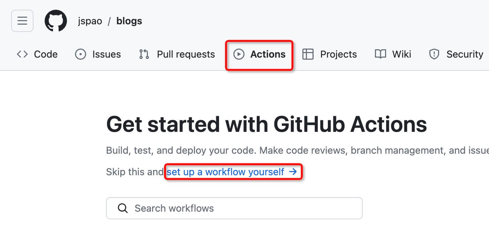
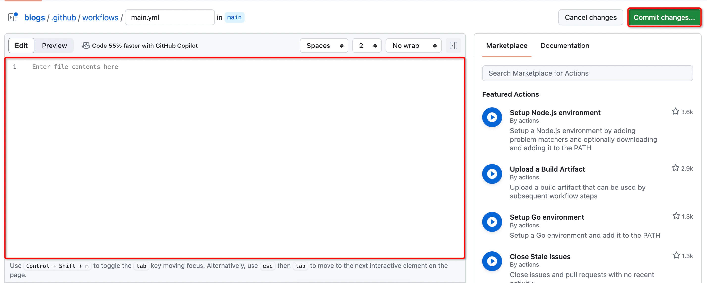
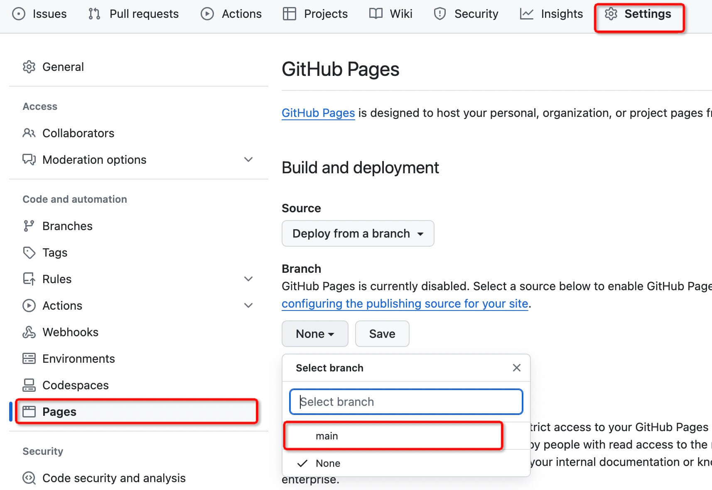
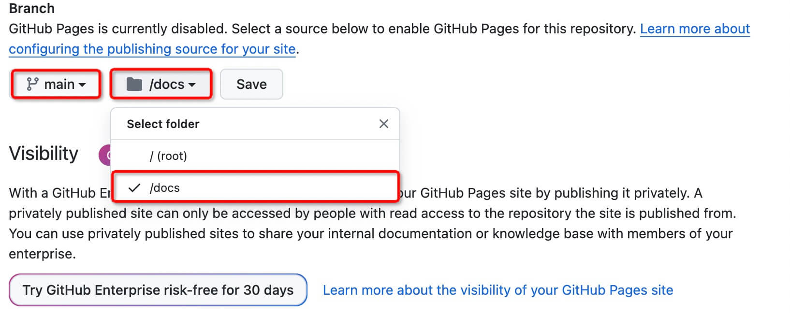
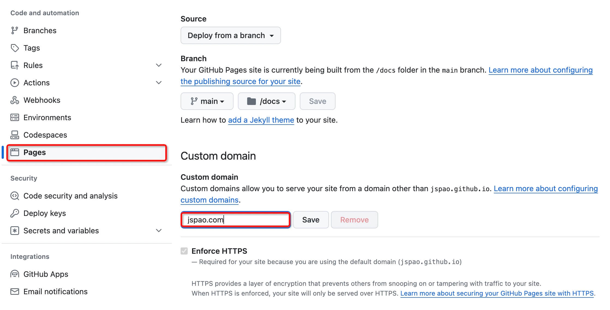
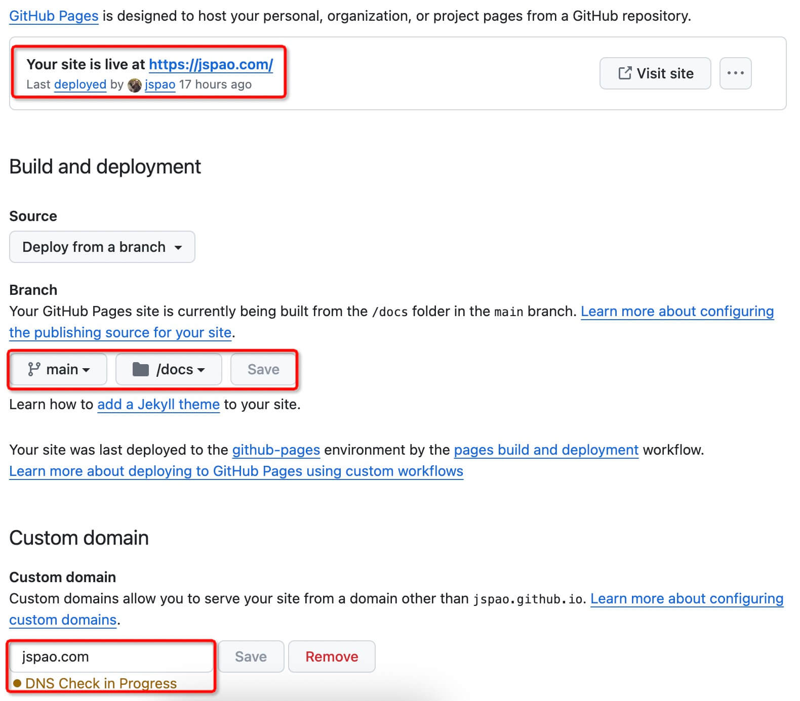

# VitePress 搭建指南

本教程将带你从零开始搭建 VitePress 文档站点，并部署到 GitHub Pages，同时配置自定义域名访问。

::: tip 官方资源
- [VitePress 官方文档](https://vitepress.dev/zh/guide/what-is-vitepress)
- [GitHub 仓库](https://github.com/vuejs/vitepress)
:::

## 什么是 VitePress？

VitePress 是一个**静态站点生成器 (SSG)**，专为构建快速、以内容为中心的站点而设计。

**核心特点：**
- 🚀 基于 Vite，启动和构建速度极快
- 📝 使用 Markdown 编写内容
- 🎨 内置美观的默认主题
- 🔍 支持全文搜索
- 📱 响应式设计，适配移动端

## 环境准备

在开始之前，请确保已安装以下工具：

| 工具 | 版本要求 | 下载地址 |
|------|---------|---------|
| Node.js | LTS 版本（推荐） | [官网下载](https://nodejs.org) |
| pnpm | 最新版 | [中文官网](https://www.pnpm.cn) / [英文官网](https://pnpm.io/) |

::: tip 为什么选择 pnpm？
- 安装速度快
- 节省磁盘空间
- 严格的依赖管理
:::

## 安装 VitePress

### 1. 安装依赖

在项目目录下执行：

```sh
# 安装 VitePress
pnpm add -D vitepress
```

### 2. 初始化配置

执行初始化向导：

```sh
pnpm vitepress init
```

向导会询问以下问题：

```sh
┌  Welcome to VitePress!
│
◇  Where should VitePress initialize the config?
│  ./docs              # 配置文件存放目录
│
◇  Site title:
│  My Awesome Project  # 网站标题
│
◇  Site description:
│  A VitePress Site    # 网站描述
│
◆  Theme:
│  ● Default Theme (Out of the box, good-looking docs)  # 默认主题
│  ○ Default Theme + Customization                       # 默认主题 + 自定义
│  ○ Custom Theme                                        # 自定义主题
└
```

### 3. 启动项目

```sh
pnpm docs:dev
```

::: tip 建议
- 推荐使用最新版 Node.js，VitePress 会主动对齐最新版本
- 初始化配置后续可在 `docs/.vitepress/config.js` 中修改
:::

## 项目目录结构

推荐的项目组织方式：

```
jspao/                          # 项目根目录
├── docs/                       # 文档目录
│   ├── .vitepress/            # VitePress 配置
│   │   ├── config.js          # 站点配置文件
│   │   └── dist/              # 构建输出目录（自动生成）
│   ├── guide/                 # 指南文档
│   ├── tools/                 # 工具文档
│   ├── technology/            # 技术文档
│   └── public/                # 静态资源
├── package.json               # 项目依赖
├── pnpm-lock.yaml            # 锁定文件
└── README.md                  # 项目说明
```

::: tip 目录说明
- `docs/` - 所有文档内容存放于此
- `docs/.vitepress/` - VitePress 配置文件
- `docs/public/` - 静态资源（图片、字体等）
:::

## config.js 配置参考

```js
export default {
  lang: "zh",
  title: "前端笔记",
  description: "项目，经验，笔记，代码片段",
  // 根节点配置
  base: "/",
  // Markdown配置
  markdown: {
    image: {
      lazyLoading: true,
    },
  },
  // 站点地图
  sitemap: "https://jspao.com",
  // 自定义head标签内的标签
  head: [["link", { rel: "icon", type: "image/svg+xml", href: "/logo.svg" }]],
  themeConfig: {
    // 站点logo配置
    logo: "/logo.svg",
    // 搜索
    search: {
      provider: "local",
    },
    // 文章页脚更新时间
    lastUpdated: {
      text: "更新时间",
      formatOptions: {
        dateStyle: "full",
        timeStyle: "medium",
      },
    },
    // One this page 中文配置
    outline: {
      level: "deep",
      label: "当前页目录",
    },
    // 翻页中文自定义
    docFooter: {
      prev: "上一篇",
      next: "下一篇",
    },
    // 文章页脚
    editLink: {
      pattern: "https://github.com/jspao/blog/tree/main/docs:path",
      text: "错误修正及完善",
    },
    // 底部信息
    footer: {
      message: "山与海都很美，努力走出去",
      copyright: "© 2025 jspao.com",
    },
    // 顶部导航栏
    nav: [
      { text: "工具使用", link: "/tools/vscode", activeMatch: "/tools/" },
      {
        text: "常用第三方入口",
        items: [{ text: "NaiveUI官网", link: "https://www.naiveui.com/zh-CN/os-theme/components/button" }],
      },
    ],
    // 社会化链接
    socialLinks: [{ icon: "github", link: "https://github.com/jspao/blog" }],
    // 配置侧边栏配置
    sidebar: {
      "/tools/": {
        base: "/tools/",
        items: [
          {
            text: "工具使用",
            collapsed: false,
            items: [{ text: "VSCode", link: "vscode" }],
          },
        ],
      },
    },
  },
};
```

## package.json 配置

根据目录结构调整 scripts：

```json
{
  "name": "fe-notes",
  "version": "1.0.0",
  "devDependencies": {
    "vitepress": "^1.1.3"
  },
  "scripts": {
    "docs:dev": "vitepress dev docs",
    "docs:build": "vitepress build docs",
    "docs:preview": "vitepress preview docs"
  }
}
```

::: tip 配置说明
- `docs:dev` - 启动开发服务器
- `docs:build` - 构建生产环境（输出到 `docs/.vitepress/dist`）
- `docs:preview` - 本地预览构建结果
:::

## 部署到 GitHub Pages

### 前置准备

1. **GitHub 账号** - 注册 [GitHub](https://github.com)
2. **代码仓库** - 创建仓库（名称如 `blog`、`notes`、`docs` 均可）
3. **自定义域名**（可选）- 在域名服务商处购买：
   - [阿里云](https://wanwang.aliyun.com/domain/searchresult/)
   - [西部数码](https://www.west.cn/services/domain/)
   - [GoDaddy](https://dcc.godaddy.com/)

::: warning 前提条件
确保已完成：
- ✅ 本地 VitePress 项目可正常运行
- ✅ 项目已推送到 GitHub 仓库
:::

### 配置 GitHub Actions

#### 1. 进入 Actions 页面

登录 GitHub → 点击头像 → `Your repositories` → 选择你的仓库 → `Actions` 标签页 → `set up a workflow yourself`



#### 2. 创建工作流文件

将以下配置粘贴到 `main.yml`（注意修改标注 `****` 的部分）：



```yaml
# 构建 VitePress 站点并将其部署到 GitHub Pages 的示例工作流程
# **** 这里的名称随意定义，你可以根据自己的实际情况来
name: Deploy VitePress site to Pages

on:
  # 在针对 `main` 分支的推送上运行。如果你
  # 使用 `master` 分支作为默认分支，请将其更改为 `master`
  push:
    branches: [main]

  # 允许你从 Actions 选项卡手动运行此工作流程
  workflow_dispatch:

# 设置 GITHUB_TOKEN 的权限，以允许部署到 GitHub Pages
permissions:
  contents: read
  pages: write
  id-token: write

# 只允许同时进行一次部署，跳过正在运行和最新队列之间的运行队列
# 但是，不要取消正在进行的运行，因为我们希望允许这些生产部署完成
concurrency:
  group: pages
  cancel-in-progress: false

jobs:
  # 构建工作
  build:
    runs-on: ubuntu-latest
    steps:
      - name: Checkout
        uses: actions/checkout@v4
        with:
          fetch-depth: 0 # 如果未启用 lastUpdated，则不需要
        - uses: pnpm/action-setup@v3 # 如果使用 pnpm，请取消注释 **** 因为我们使用pnpm所以这里我帮助开启了
          with: # **** 这里因为使用了pnpm所以要制定一个版本，避免报错
          version: 8 # **** 这里因为使用了pnpm所以要制定一个版本，避免报错，当前我使用的是8，未来可能是9,10,11请根据当下情况调整版本即可
      # - uses: oven-sh/setup-bun@v1 # 如果使用 Bun，请取消注释
      - name: Setup Node
        uses: actions/setup-node@v4
        with:
          node-version: 20 # **** 此处node版本目前是20，未来可能是21,22,23,24...请根据当下实际情况修改即可
          cache: pnpm # 或 npm / yarn **** 这里我更换为pnpm了，推荐使用pnpm
      - name: Setup Pages
        uses: actions/configure-pages@v4
      - name: Install dependencies
        run: pnpm i # 或 npm install / yarn install / bun install **** 这里我更换为pnpm了，推荐使用pnpm
      - name: Build with VitePress
        run: pnpm docs:build # 或 npm run docs:build / yarn docs:build / bun run docs:build **** 这里我更换为pnpm了，推荐使用pnpm
      - name: Upload artifact
        uses: actions/upload-pages-artifact@v3
        with:
          path: docs/.vitepress/dist # **** 这里我更改了路径，因为默认路径是docs/.vitepress/dist，但是这里我更改了路径，所以这里需要修改

  # 部署工作
  deploy:
    environment:
      name: github-pages
      url: ${{ steps.deployment.outputs.page_url }}
    needs: build
    runs-on: ubuntu-latest
    name: Deploy
    steps:
      - name: Deploy to GitHub Pages
        id: deployment
        uses: actions/deploy-pages@v4
```

填写完成后，点击右上角 `Commit changes...` 提交，将在 `.github/workflows/main.yml` 创建该文件。

### 配置 GitHub Pages

#### 1. 进入 Pages 设置

仓库 → `Settings` → `Pages`

#### 2. 配置部署分支

在 `Branch` 中选择 `main` 分支（根据你的实际情况选择）：



#### 3. 配置文档路径

文档存放在 `docs` 目录，所以路径选择 `/docs`：



#### 4. 配置自定义域名（可选）

在 `Custom domain` 中填写你的域名，点击 `Save`：

::: tip 域名备案说明
GitHub Pages 服务器在海外，解析到 GitHub 的域名**无需备案**。
:::



#### 5. 域名 DNS 解析

在域名服务商处添加以下记录：

**A 记录**（IPv4）：
```
185.199.108.153
185.199.109.153
185.199.110.153
185.199.111.153
```

**AAAA 记录**（IPv6）：
```
2606:50c0:8000::153
2606:50c0:8001::153
2606:50c0:8002::153
2606:50c0:8003::153
```

**CNAME 记录**（www 子域名）：
```
USERNAME.github.io  # 将 USERNAME 替换为你的 GitHub 用户名
```


#### 6. 完成部署

配置完成后，点击 `Visit site` 访问你的站点：



## 总结

完成以上配置后，你的 VitePress 站点已实现**自动化部署**：

1. 本地编写文档
2. 提交代码到 `main` 分支
3. GitHub Actions 自动构建并部署
4. 访问你的站点查看最新内容

::: tip 后续维护
- 日常更新只需编辑 Markdown 文件并推送
- 配置变更修改 `docs/.vitepress/config.js`
- 静态资源放入 `docs/public` 目录
:::
