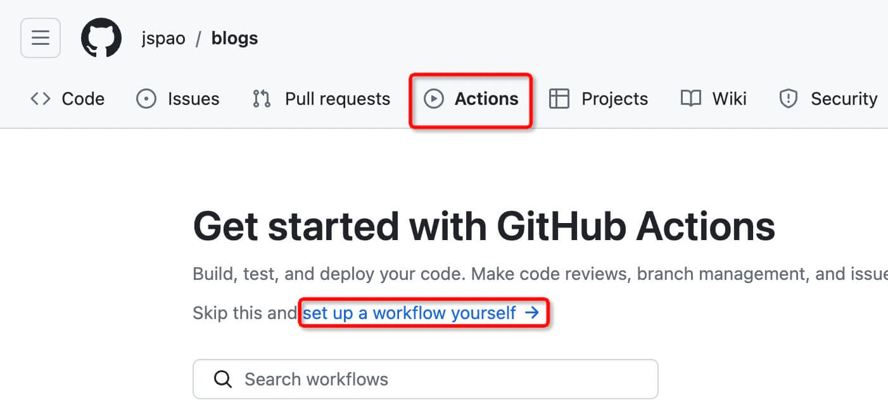

# 搭建 Vitepress 文档

本文记录，利用 vitepress 从 0 开始搭建的步骤，最终部署到 Github Pages，并通过自有域名访问。

[官方文档](https://vitepress.dev/zh/guide/what-is-vitepress)

## VitePress 是什么？

VitePress 是一个静态站点生成器 (SSG)，专为构建快速、以内容为中心的站点而设计。简而言之，VitePress 获取用 Markdown 编写的内容，对其应用主题，并生成可以轻松部署到任何地方的静态 HTML 页面。

## Vitepress 准备工作

1. 安装`nodejs`，[官网入口](https://nodejs.org)，建议下载 LTS 版本（稳定版）
2. 安装`pnpm`，[中文官网入口](https://www.pnpm.cn)，[英文官网入口](https://pnpm.io/)，根据自己语言喜好选择

## 安装 VitePress

[官方步骤入口](https://vitepress.dev/zh/guide/getting-started)

```sh
pnpm add -D vitepress
```

安装完成后，还需要执行一次安装向导

```sh
pnpm vitepress init
```

将需要回答几个简单的问题：

```sh
# 欢迎来到VitePress
┌  Welcome to VitePress!
│  # 在哪里初始化项目
◇  Where should VitePress initialize the config?
│  ./docs
│  # 网站标题
◇  Site title:
│  My Awesome Project
│  # 网站描述
◇  Site description:
│  A VitePress Site
│  # 主题
◆  Theme:
│  ● Default Theme (Out of the box, good-looking docs) # 默认主题
│  ○ Default Theme + Customization # 默认主题 + 自定义
│  ○ Custom Theme # 自定义主题
└
```

执行完向导以后，即可启动项目

```sh
pnpm docs:dev
```

::: tip
项目启动以后可以根据官网进行个性化配置，这里就不过多赘述了，网上一大堆脚程，可自行百度！但是要注意一点，推荐使用最新版本的 node，因为官方是会主动对齐最新 node 版本的，跟定最新不吃亏！
:::

## 目录结构

```
jspao
├─ CNAME
├─ README.md
├─ docs # 注意这里，如果你也跟我一样将文档统一放到docs内进行管理，那么package.json中的配置请参考下面的
│  ├─ .vitepress
│  │  └─ config.js
│  ├─ CNAME
│  └─ tools
│     └─ vscode.md
├─ package.json
└─ pnpm-lock.yaml
```

## config.js 配置参考

```js
export default {
  lang: "zh",
  title: "前端笔记",
  description: "项目，经验，笔记，代码片段",
  // 根节点配置
  base: "/",
  // Markdown配置
  markdown: {
    image: {
      lazyLoading: true,
    },
  },
  // 站点地图
  sitemap: "https://jspao.com",
  // 自定义head标签内的标签
  head: [["link", { rel: "icon", type: "image/svg+xml", href: "/logo.svg" }]],
  themeConfig: {
    // 站点logo配置
    logo: "/logo.svg",
    // 搜索
    search: {
      provider: "local",
    },
    // 文章页脚更新时间
    lastUpdated: {
      text: "更新时间",
      formatOptions: {
        dateStyle: "full",
        timeStyle: "medium",
      },
    },
    // One this page 中文配置
    outline: {
      level: "deep",
      label: "当前页目录",
    },
    // 翻页中文自定义
    docFooter: {
      prev: "上一篇",
      next: "下一篇",
    },
    // 文章页脚
    editLink: {
      pattern: "https://github.com/jspao/blog/tree/main/docs:path",
      text: "错误修正及完善",
    },
    // 底部信息
    footer: {
      message: "山与海都很美，努力走出去",
      copyright: "© 2024 jspao.com",
    },
    // 顶部导航栏
    nav: [
      { text: "工具使用", link: "/tools/vscode", activeMatch: "/tools/" },
      {
        text: "常用第三方入口",
        items: [{ text: "NaiveUI官网", link: "https://www.naiveui.com/zh-CN/os-theme/components/button" }],
      },
    ],
    // 社会化链接
    socialLinks: [{ icon: "github", link: "https://github.com/jspao/blog" }],
    // 配置侧边栏配置
    sidebar: {
      "/tools/": {
        base: "/tools/",
        items: [
          {
            text: "工具使用",
            collapsed: false,
            items: [{ text: "VSCode", link: "vscode" }],
          },
        ],
      },
    },
  },
};
```

## package.json 配置参考

之所以后面增加了 `docs` 是因为我的目录结构调整了一下， 我将文档内容进行统一管理，所以我的启动项应该是在 `docs` 内启动，即接下来`workflow`配置中的`path: docs/.vitepress/dist`路径

```json
{
  "name": "fe-notes",
  "version": "1.0.0",
  "devDependencies": {
    "vitepress": "^1.1.3"
  },
  "scripts": {
    "docs:dev": "vitepress dev docs",
    "docs:build": "vitepress build docs",
    "docs:preview": "vitepress preview docs"
  }
}
```

## 部署到 Github Pages

1. 准备一个 github 账号
2. 准备一个 github 仓库，仓库名称随意，我见过的：`blog`，`Notes`，`doc`
3. 如果需要使用独立域名的话，可以前往对应的域名厂商注册及购买，我常用的：[阿里云](https://wanwang.aliyun.com/domain/searchresult/)，[西部数码](https://www.west.cn/services/domain/)，[Godaddy](https://dcc.godaddy.com/)

::: warning
准备部署前，我们先来统一一下概念：比如我已经有了 Github 账号及名为 `blogs` 的仓库，且本地已经配置好了 Vitepress，同时也将本地的 Vitepress 项目 `push` 到 `blogs` 仓库了
:::

### 快速进入仓库

登录 Github 后，点击右上角头像，选择 `Your repositories`，选择 `blogs`，即可进入仓库

### 配置 Actions

1. 进入仓库后，进入顶部 `tab` 栏中的 `Actions` 选项，并点击 `set up a workflow yourself`，进入 `workflow` 配置页面



2. 配置 `workflow`

复制如下代码粘贴到 `main.yml` 中如下图，其中有一部分是需要配置的，请根据实际情况填写，具体请详看代码 `****` 部分


```yaml
# 构建 VitePress 站点并将其部署到 GitHub Pages 的示例工作流程
# **** 这里的名称随意定义，你可以根据自己的实际情况来
name: Deploy VitePress site to Pages

on:
  # 在针对 `main` 分支的推送上运行。如果你
  # 使用 `master` 分支作为默认分支，请将其更改为 `master`
  push:
    branches: [main]

  # 允许你从 Actions 选项卡手动运行此工作流程
  workflow_dispatch:

# 设置 GITHUB_TOKEN 的权限，以允许部署到 GitHub Pages
permissions:
  contents: read
  pages: write
  id-token: write

# 只允许同时进行一次部署，跳过正在运行和最新队列之间的运行队列
# 但是，不要取消正在进行的运行，因为我们希望允许这些生产部署完成
concurrency:
  group: pages
  cancel-in-progress: false

jobs:
  # 构建工作
  build:
    runs-on: ubuntu-latest
    steps:
      - name: Checkout
        uses: actions/checkout@v4
        with:
          fetch-depth: 0 # 如果未启用 lastUpdated，则不需要
        - uses: pnpm/action-setup@v3 # 如果使用 pnpm，请取消注释 **** 因为我们使用pnpm所以这里我帮助开启了
          with: # **** 这里因为使用了pnpm所以要制定一个版本，避免报错
          version: 8 # **** 这里因为使用了pnpm所以要制定一个版本，避免报错，当前我使用的是8，未来可能是9,10,11请根据当下情况调整版本即可
      # - uses: oven-sh/setup-bun@v1 # 如果使用 Bun，请取消注释
      - name: Setup Node
        uses: actions/setup-node@v4
        with:
          node-version: 20 # **** 此处node版本目前是20，未来可能是21,22,23,24...请根据当下实际情况修改即可
          cache: pnpm # 或 npm / yarn **** 这里我更换为pnpm了，推荐使用pnpm
      - name: Setup Pages
        uses: actions/configure-pages@v4
      - name: Install dependencies
        run: pnpm i # 或 npm install / yarn install / bun install **** 这里我更换为pnpm了，推荐使用pnpm
      - name: Build with VitePress
        run: pnpm docs:build # 或 npm run docs:build / yarn docs:build / bun run docs:build **** 这里我更换为pnpm了，推荐使用pnpm
      - name: Upload artifact
        uses: actions/upload-pages-artifact@v3
        with:
          path: docs/.vitepress/dist # **** 这里我更改了路径，因为默认路径是docs/.vitepress/dist，但是这里我更改了路径，所以这里需要修改

  # 部署工作
  deploy:
    environment:
      name: github-pages
      url: ${{ steps.deployment.outputs.page_url }}
    needs: build
    runs-on: ubuntu-latest
    name: Deploy
    steps:
      - name: Deploy to GitHub Pages
        id: deployment
        uses: actions/deploy-pages@v4
```

全部填写完成后点击右上角`绿色` 按钮 `Commit changes...` 触发`弹窗`进行提交，就会在在项目的 `.github/workflows` 目录中创建一个名为 `main.yml` 的文件

### 配置 Github Pages

1. 进入`blogs`仓库后，进入顶部 `tab` 栏中的 `Settings`
2. 选择 `Pages` 找到右侧的 `Branch`，对 `Branch` 配置一个 `main` 分支（你的项目如果在别的分支，那你就根据实际情况选择即可，我的是在 `main` 分支）

   

3. 分支配置好后就要配置项目文件夹，因为我将文档都存放到了 `docs` 内，所以这里我选择的路径是 `/docs`

   

4. 配置域名（因为 Github 为海外站点，所以解析到 Github 的域名不需要备案）填写好后点击 `save` 即可保存

   

5. 解析域名，每个域名商操作方式不一样，这里我只做了 `A` 记录（jspao.com），`CNAME` 记录（www.jspao.com），`AAAA` 记录（jspao.com）

   - `A` 记录有 4 个可选

     - 185.199.108.153
     - 185.199.109.153
     - 185.199.110.153
     - 185.199.111.153

   - `AAAA` 记录有 4 个可选

     - 2606:50c0:8000::153
     - 2606:50c0:8001::153
     - 2606:50c0:8002::153
     - 2606:50c0:8003::153

   - `CNAME` 记录 有 2 个可选（USERNAME 换成你的 github 账号名称即可，在地址栏可以查看，比如`https://github.com/jspao/blog/settings/pages`，`jspao` 就是我的用户名了，以此类推，`USERNAME` 就改为`jspao`，如果是以公司为单位的话那么 ORGANIZATION 就替换成组织的账号即可）
     - USERNAME.github.io
     - ORGANIZATION.github.io

   

6. 完成范例，所有操作结束之后如下如，可以点击 `Visit site` 访问 Github Pages 了

   

## 结语

因为配置了 Github 的工作流，所以后续 vitepress 项目文档就可以实现 `push` 之后自动化部署了，省时省心省力！
