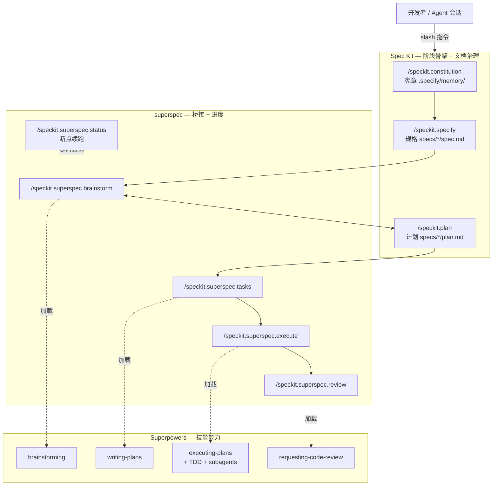

# Spec Kit + Superpowers AI 工作流

日常功能开发可按阶段使用 slash 指令推进。三者分工可以记成一句话：

**Spec Kit 管「写什么、落哪些文档」→ Superpowers 管「怎么想清楚、怎么写代码」→ superspec 把两边拼成一条可恢复的流水线。**

> **产物位置**：本流程产物默认落在 `specs/NNN-*/`（如 `spec.md` / `plan.md` / `tasks.md`）。

## 三件套分别是什么

### Spec Kit（规格驱动开发工具包）

- **是什么**：[github/spec-kit](https://github.com/github/spec-kit) 提供的 **Spec-Driven Development（规格驱动开发）** 工具包。核心是 CLI `specify`，以及给各类 AI Coding Agent（Cursor / Claude Code / Codex 等）用的 `/speckit.*` 斜杠命令与文档模板。
- **解决什么问题**：先把需求、原则、技术计划固化成可执行的 Markdown，再往下写代码，而不是直接「凭感觉 vibe coding」。
- **你实际拿到的东西**：
  - 项目治理：`.specify/`（含宪章 `constitution.md`、模板等）
  - 功能产物：`specs/NNN-功能名/` 下的 `spec.md`、`plan.md`、`tasks.md` 等
  - 核心命令：`/speckit.constitution`、`/speckit.specify`、`/speckit.plan`、`/speckit.tasks` 等
- **一句话**：提供**阶段骨架 + 文档治理**，规定开发按「宪章 → 规格 → 计划 → …」推进。

### Superpowers（Agent 技能与开发方法论）

- **是什么**：[obra/superpowers](https://github.com/obra/superpowers) 提供的一套 **Agent Skills（技能）+ 软件开发方法论**。以 `SKILL.md` 形式安装进 Claude Code / Cursor / Codex 等，Agent 在干活前应按技能流程行动，而不是直接开写。
- **解决什么问题**：把「澄清需求、拆任务、TDD、子代理执行、代码审查」变成可复用、可强制的工作流，而不是靠模型临场发挥。
- **你实际拿到的东西**：一批技能目录，常见包括：
  - `brainstorming`：动手前先澄清设计
  - `writing-plans`：拆成可执行小任务
  - `executing-plans` / `subagent-driven-development`：按计划执行（可派生子代理）
  - `test-driven-development`：红-绿-重构
  - `requesting-code-review`：对照计划做审查
- **一句话**：提供**工程纪律与能力模块**（怎么想、怎么拆、怎么测、怎么审）。

### superspec（Spec Kit ↔ Superpowers 桥接扩展）

- **是什么**：[WangX0111/superspec](https://github.com/WangX0111/superspec) 是 **Spec Kit 的扩展（extension）**，用 `specify extension add superspec` 安装。自己再加一套 `/speckit.superspec.*` 命令。
- **解决什么问题**：Spec Kit 只保证「文档阶段在」；真正深度澄清、细拆任务、TDD 执行、审查，需要交给 Superpowers。superspec 负责探测本机/项目里的 Superpowers 技能，并在对应阶段真正加载它们。
- **你实际拿到的东西**：
  - 额外命令：`brainstorm` / `tasks` / `execute` / `review` / `status`
  - 进度持久化：`specs/NNN-*/progress.yml` 等，会话中断后可 `/speckit.superspec.status` 续跑
  - 技能探测缓存：`.specify/superpowers.yml`
- **一句话**：做**胶水层**——左边接 Spec Kit 的阶段与文档，右边接 Superpowers 的技能；未装技能时多数命令仍有内置降级方案。

### 三者关系



| 组件 | 形态 | 主要产出 |
| ---- | ---- | -------- |
| Spec Kit | CLI + `/speckit.*` + 模板 | 宪章、规格、计划等治理文档 |
| Superpowers | Agent Skills（`SKILL.md`） | 更严的澄清/执行/测试/审查行为 |
| superspec | Spec Kit 扩展 | 把上述阶段接到技能，并支持断点续跑 |

## 安装与配置

按顺序装齐三件套后，才能在项目里跑完整流程。前置：已安装 [uv](https://docs.astral.sh/uv/)，并使用支持 slash / 插件的 Coding Agent（下文以 **Cursor** 为例）。

### 1. 安装 Spec Kit CLI

```bash
uv tool install specify-cli
```

验证：

```bash
specify --help
```

若要在已有仓库启用 Spec Kit（尚未初始化时）：

```bash
# 在项目根目录执行；--integration 按所用 Agent 选择（如 cursor / claude / copilot 等）
specify init --here --integration cursor
```

### 2. 安装 Superpowers（Cursor）

在 Cursor Agent 对话里执行：

```text
/add-plugin superpowers
```

也可在 Cursor 插件市场搜索 `superpowers` 安装。其他 Agent 见 [obra/superpowers](https://github.com/obra/superpowers)。

::: tip 技能目录：优先项目内
superspec 探测时**以项目目录为准**，找不到再回退到用户目录：

1. **优先**：`<项目根>/.agents/skills/{skill-name}/SKILL.md`
2. **回退**：`~/.agents/skills/{skill-name}/SKILL.md`

项目里没有、但用户目录有时：照样能跑（用回退路径）。要把技能**正式纳入本仓库**时，用下面任一方式加入项目。
:::

#### 项目内没有 skill 时怎么加进来

superspec 需要的关键技能目录名：`brainstorming`、`writing-plans`、`executing-plans`、`test-driven-development`、`subagent-driven-development`、`requesting-code-review`。

**方式 A：从 obra/superpowers 克隆后拷贝（推荐，适合提交进仓库）**

```bash
# 在项目根目录
git clone --depth 1 https://github.com/obra/superpowers.git /tmp/superpowers
mkdir -p .agents/skills

for s in brainstorming writing-plans executing-plans \
         test-driven-development subagent-driven-development \
         requesting-code-review; do
  cp -R "/tmp/superpowers/skills/$s" ".agents/skills/$s"
done

# 确认
ls .agents/skills/*/SKILL.md
```

**方式 B：软链本机已有技能（适合本机已 `/add-plugin`，不想重复拷贝）**

```bash
mkdir -p .agents/skills

# 若技能已在用户目录
for s in brainstorming writing-plans executing-plans \
         test-driven-development subagent-driven-development \
         requesting-code-review; do
  [ -f "$HOME/.agents/skills/$s/SKILL.md" ] && \
    ln -sfn "$HOME/.agents/skills/$s" ".agents/skills/$s"
done
```

**方式 C：只链某一个缺的 skill**

```bash
mkdir -p .agents/skills
ln -sfn "$HOME/.agents/skills/brainstorming" .agents/skills/brainstorming
# 或: cp -R /tmp/superpowers/skills/brainstorming .agents/skills/
```

加完后跑 `/speckit.superspec.status`，应能看到对应技能被检测到（缓存见 `.specify/superpowers.yml`）。

> 注意：目录名须与上表**完全一致**（区分大小写），且目录内必须有 `SKILL.md`。软链目标若只在你本机，协作者拉仓库后仍需各自准备技能；要共享请用方式 A 把文件提交进项目。

### 3. 安装 superspec 扩展

在**已初始化 Spec Kit 的项目根目录**执行：

```bash
specify extension add superspec
```

装好后会多出 `/speckit.superspec.*` 系列命令；superspec 会按上表路径探测 Superpowers（**项目内优先**），结果缓存到 `.specify/superpowers.yml`。

### 4. 验证是否就绪

在 Agent 会话中执行：

```text
/speckit.superspec.status
```

正常时应能看到宪章状态、各功能阶段进度，以及 Superpowers 技能探测情况，并给出建议的下一步指令。

### 安装顺序小结

```text
uv tool install specify-cli          # Spec Kit CLI
/add-plugin superpowers              # Superpowers（Cursor Agent）
specify extension add superspec      # 桥接扩展（项目内）
/speckit.superspec.status            # 自检 / 看进度
```

## 阶段 → 指令

Spec Kit 核心阶段 + superspec 桥接阶段对照如下。带 `superspec` 的指令会在探测到技能时加载 Superpowers，否则走扩展内置降级逻辑。

| 阶段 | 指令 | 背后能力 |
| ---- | ---- | -------- |
| **宪章** | `/speckit.constitution` | Spec Kit |
| **规格** | `/speckit.specify "…"` | Spec Kit |
| **头脑风暴** | `/speckit.superspec.brainstorm` | Superpowers → `brainstorming` |
| **计划** | `/speckit.plan` | Spec Kit（可与 brainstorm 多轮改 MD） |
| **任务** | `/speckit.superspec.tasks` | Superpowers → `writing-plans` |
| **执行** | `/speckit.superspec.execute` | Superpowers → `executing-plans` + `test-driven-development` + `subagent-driven-development` |
| **审查** | `/speckit.superspec.review` | Superpowers → `requesting-code-review` |

### superspec 相关指令（接 Superpowers）

| 指令 | 作用 | 优先加载的 Superpowers 技能 |
| ---- | ---- | --------------------------- |
| `/speckit.superspec.status` | 查看进度、技能探测结果，建议下一步 | —（自检 / 续跑入口） |
| `/speckit.superspec.brainstorm` | 深挖边界情况，打磨 `spec.md` | `brainstorming` |
| `/speckit.superspec.tasks` | 生成分阶段任务清单 `tasks.md` | `writing-plans` |
| `/speckit.superspec.execute` | 按任务实现（TDD + 可派生子代理） | `executing-plans` + `test-driven-development` + `subagent-driven-development` |
| `/speckit.superspec.review` | 对照规格 / 计划做代码审查 | `requesting-code-review` |

> Spec Kit 自身仍提供：`/speckit.constitution`、`/speckit.specify`、`/speckit.plan`、`/speckit.tasks`、`/speckit.checklist` 等。日常一条龙里，任务 / 执行 / 审查优先用上表的 `superspec` 版本，才会真正吃到 Superpowers。

## 技能探测路径

superspec 探测顺序（**项目内优先，用户级回退**）：

| 优先级 | 路径 | 用途 |
| ------ | ---- | ---- |
| 1（优先） | `.agents/skills/{skill-name}/SKILL.md` | 项目内技能，建议团队以此为准 |
| 2（回退） | `~/.agents/skills/{skill-name}/SKILL.md` | 本机全局技能 |

同名技能会优先用项目内的，不会被用户目录覆盖。探测结果写入 `.specify/superpowers.yml`。

装完仍检测不到时：确认技能是否落在上表路径（尤其是项目 `.agents/skills/`），或重启 Agent 后再跑 `/speckit.superspec.status`。

## 一条龙示例

```text
/speckit.constitution
/speckit.specify "你的功能描述"
/speckit.superspec.brainstorm
/speckit.plan
/speckit.superspec.tasks
/speckit.superspec.execute
/speckit.superspec.review
```

## 使用说明

- **宪章**：项目级，一般在初始化或原则变更时跑一次，不必每个功能都做。
- **头脑风暴** 与 **计划**：可持续迭代，主要更新 `spec.md` / `plan.md`，可来回多轮再进入任务。
- **会话中断**：先跑 `/speckit.superspec.status`，按建议的下一步继续即可。

## 推荐顺序（速查）

阶段按下面顺序推进；灰色为 Spec Kit 核心命令，其余由 superspec 桥接 Superpowers。


- `brainstorm` ↔ `plan` 可多轮打磨，定稿后再进入 `tasks` → `execute` → `review`
- 任意时刻可用 `/speckit.superspec.status` 查看进度并续跑
