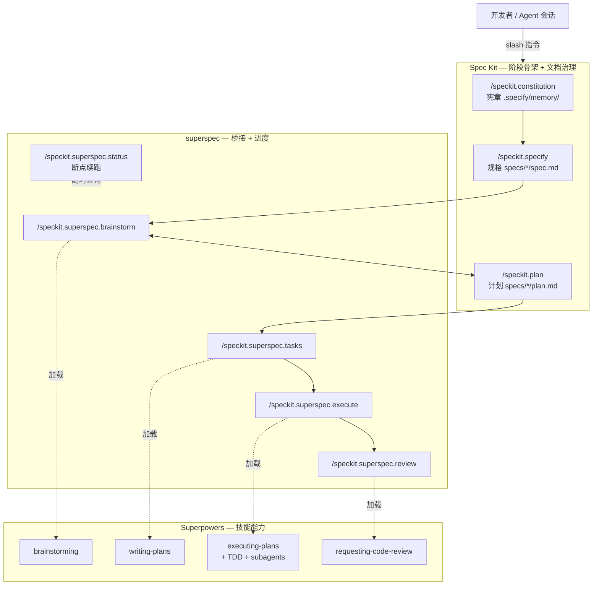

# Spec Kit + Superpowers AI 工作流

日常功能开发可按阶段使用 slash 指令推进。三者分工可以记成一句话：

**Spec Kit 管「写什么、落哪些文档」→ Superpowers 管「怎么想清楚、怎么写代码」→ superspec 把两边拼成一条可恢复的流水线。**

> **产物位置**：本流程产物默认落在 `specs/NNN-*/`（如 `spec.md` / `plan.md` / `tasks.md`）。

## 三件套分别是什么

### Spec Kit（规格驱动开发工具包）

- **是什么**：[github/spec-kit](https://github.com/github/spec-kit) 提供的 **Spec-Driven Development（规格驱动开发）** 工具包。核心是 CLI `specify`，以及给各类 AI Coding Agent（Cursor / Claude Code / Codex 等）用的 `/speckit.*` 斜杠命令与文档模板。
- **解决什么问题**：先把需求、原则、技术计划固化成可执行的 Markdown，再往下写代码，而不是直接「凭感觉 vibe coding」。
- **你实际拿到的东西**：
  - 项目治理：`.specify/`（含宪章 `constitution.md`、模板等）
  - 功能产物：`specs/NNN-功能名/` 下的 `spec.md`、`plan.md`、`tasks.md` 等
  - 核心命令：`/speckit.constitution`、`/speckit.specify`、`/speckit.plan`、`/speckit.tasks` 等
- **一句话**：提供**阶段骨架 + 文档治理**，规定开发按「宪章 → 规格 → 计划 → …」推进。

### Superpowers（Agent 技能与开发方法论）

- **是什么**：[obra/superpowers](https://github.com/obra/superpowers) 提供的一套 **Agent Skills（技能）+ 软件开发方法论**。以 `SKILL.md` 形式安装进 Claude Code / Cursor / Codex 等，Agent 在干活前应按技能流程行动，而不是直接开写。
- **解决什么问题**：把「澄清需求、拆任务、TDD、子代理执行、代码审查」变成可复用、可强制的工作流，而不是靠模型临场发挥。
- **你实际拿到的东西**：一批技能目录，常见包括：
  - `brainstorming`：动手前先澄清设计
  - `writing-plans`：拆成可执行小任务
  - `executing-plans` / `subagent-driven-development`：按计划执行（可派生子代理）
  - `test-driven-development`：红-绿-重构
  - `requesting-code-review`：对照计划做审查
- **一句话**：提供**工程纪律与能力模块**（怎么想、怎么拆、怎么测、怎么审）。

### superspec（Spec Kit ↔ Superpowers 桥接扩展）

- **是什么**：[WangX0111/superspec](https://github.com/WangX0111/superspec) 是 **Spec Kit 的扩展（extension）**，用 `specify extension add superspec` 安装。自己再加一套 `/speckit.superspec.*` 命令。
- **解决什么问题**：Spec Kit 只保证「文档阶段在」；真正深度澄清、细拆任务、TDD 执行、审查，需要交给 Superpowers。superspec 负责探测本机/项目里的 Superpowers 技能，并在对应阶段真正加载它们。
- **你实际拿到的东西**：
  - 额外命令：`brainstorm` / `tasks` / `execute` / `review` / `status`
  - 进度持久化：`specs/NNN-*/progress.yml` 等，会话中断后可 `/speckit.superspec.status` 续跑
  - 技能探测缓存：`.specify/superpowers.yml`
- **一句话**：做**胶水层**——左边接 Spec Kit 的阶段与文档，右边接 Superpowers 的技能；未装技能时多数命令仍有内置降级方案。

### 三者关系



| 组件 | 形态 | 主要产出 |
| ---- | ---- | -------- |
| Spec Kit | CLI + `/speckit.*` + 模板 | 宪章、规格、计划等治理文档 |
| Superpowers | Agent Skills（`SKILL.md`） | 更严的澄清/执行/测试/审查行为 |
| superspec | Spec Kit 扩展 | 把上述阶段接到技能，并支持断点续跑 |

## 阶段 → 指令

| 阶段 | 指令 | 背后能力 |
| ---- | ---- | -------- |
| **宪章** | `/speckit.constitution` | Spec Kit |
| **规格** | `/speckit.specify "…"` | Spec Kit |
| **头脑风暴** | `/speckit.superspec.brainstorm` | Superpowers → `brainstorming` |
| **计划** | `/speckit.plan` | Spec Kit（可与 brainstorm 多轮改 MD） |
| **任务** | `/speckit.superspec.tasks` | Superpowers → `writing-plans` |
| **执行** | `/speckit.superspec.execute` | Superpowers → `executing-plans` + `test-driven-development` + `subagent-driven-development` |
| **审查** | `/speckit.superspec.review` | Superpowers → `requesting-code-review` |

随时可查进度：

```text
/speckit.superspec.status
```

## 技能探测路径

superspec 按以下顺序检测 Superpowers（**项目本地优先**）：

1. `.agents/skills/{skill-name}/SKILL.md`
2. `~/.agents/skills/{skill-name}/SKILL.md`

探测结果缓存在 `.specify/superpowers.yml`。

## 一条龙示例

```text
/speckit.constitution
/speckit.specify "你的功能描述"
/speckit.superspec.brainstorm
/speckit.plan
/speckit.superspec.tasks
/speckit.superspec.execute
/speckit.superspec.review
```

## 使用说明

- **宪章**：项目级，一般在初始化或原则变更时跑一次，不必每个功能都做。
- **头脑风暴** 与 **计划**：可持续迭代，主要更新 `spec.md` / `plan.md`，可来回多轮再进入任务。
- **会话中断**：先跑 `/speckit.superspec.status`，按建议的下一步继续即可。

## 推荐顺序（速查）

阶段按下面顺序推进；灰色为 Spec Kit 核心命令，其余由 superspec 桥接 Superpowers。


- `brainstorm` ↔ `plan` 可多轮打磨，定稿后再进入 `tasks` → `execute` → `review`
- 任意时刻可用 `/speckit.superspec.status` 查看进度并续跑
