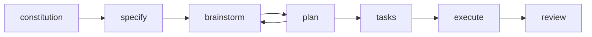

# Spec Kit + Superpowers AI 工作流

日常功能开发可按阶段使用 slash 指令推进。本仓库通过 **superspec** 把 Spec Kit 的阶段流程与 Superpowers 技能桥接；任务 / 执行 / 审查会真正加载对应技能。

> **契约与产物**
>
> - 产品功能契约仍以 `docs/specs/` 为准
> - 本流程产物默认落在 `specs/NNN-*/`

## 三件套

| 组件 | 仓库 | 职责 |
| ---- | ---- | ---- |
| **Spec Kit** | [github/spec-kit](https://github.com/github/spec-kit) | 规格驱动的阶段命令（宪章、规格、计划等） |
| **Superpowers** | [obra/superpowers](https://github.com/obra/superpowers) | 头脑风暴、写计划、TDD 执行、代码审查等技能 |
| **superspec** | [WangX0111/superspec](https://github.com/WangX0111/superspec) | 桥接二者：让部分 `/speckit.*` 指令加载 Superpowers 技能 |

## 阶段 → 指令

| 阶段 | 指令 | 背后能力 |
| ---- | ---- | -------- |
| **宪章** | `/speckit.constitution` | Spec Kit |
| **规格** | `/speckit.specify "…"` | Spec Kit |
| **头脑风暴** | `/speckit.superspec.brainstorm` | Superpowers → `brainstorming` |
| **计划** | `/speckit.plan` | Spec Kit（可与 brainstorm 多轮改 MD） |
| **任务** | `/speckit.superspec.tasks` | Superpowers → `writing-plans` |
| **执行** | `/speckit.superspec.execute` | Superpowers → `executing-plans` + `test-driven-development` + `subagent-driven-development` |
| **审查** | `/speckit.superspec.review` | Superpowers → `requesting-code-review` |

随时可查进度：

```text
/speckit.superspec.status
```

## 技能探测路径

superspec 按以下顺序检测 Superpowers（**项目本地优先**）：

1. `.agents/skills/{skill-name}/SKILL.md`
2. `~/.agents/skills/{skill-name}/SKILL.md`

探测结果缓存在 `.specify/superpowers.yml`。

## 一条龙示例

```text
/speckit.constitution
/speckit.specify "你的功能描述"
/speckit.superspec.brainstorm
/speckit.plan
/speckit.superspec.tasks
/speckit.superspec.execute
/speckit.superspec.review
```

## 使用说明

- **宪章**：项目级，一般在初始化或原则变更时跑一次，不必每个功能都做。
- **头脑风暴** 与 **计划**：可持续迭代，主要更新 `spec.md` / `plan.md`，可来回多轮再进入任务。
- **会话中断**：先跑 `/speckit.superspec.status`，按建议的下一步继续即可。

## 推荐顺序（速查）



从图中可见：`brainstorm` ↔ `plan` 可多轮打磨，定稿后再进入 `tasks` → `execute` → `review`。
